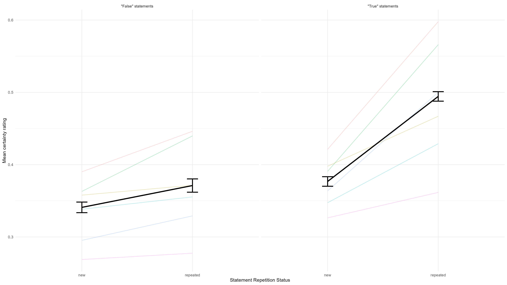
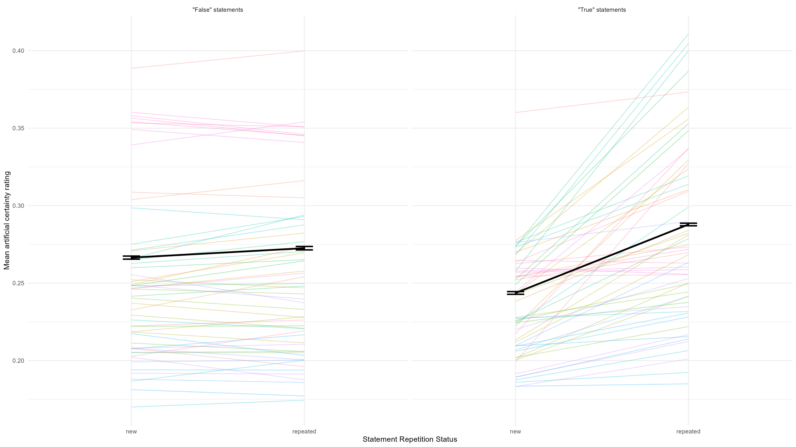

# Results

All analysis were conducted using `r r_citations$r`. In the current version of the manuscript, we included `r length(unique(analysis_data$study_id)) %>% apa_num()` studies from `r length(unique(analysis_data$publication_id)) %>% apa_num()` publications, spanning `r length(unique(analysis_data$subject)) %>% apa_num()` participants contributing `r nrow(analysis_data) %>% apa_num()` trials.

```{r}
n_studies_dichotomous <- data %>%
  filter(truth_rating_scale == "dichotomous") %>%
  pull(study_id) %>% unique() %>% length()

n_studies_likert_4 <- data %>%
  filter(truth_rating_steps == 4) %>%
  pull(study_id) %>% unique() %>% length()

n_studies_likert_6 <- data %>%
  filter(truth_rating_steps == 6) %>%
  pull(study_id) %>% unique() %>% length()

n_datasets_dichotomous <- data %>%
  filter(truth_rating_scale == "dichotomous") %>%
  nrow()

n_datasets_likert_4 <- data %>%
  filter(truth_rating_steps == 4) %>%
  nrow()

n_datasets_likert_6 <- data %>%
  filter(truth_rating_steps == 6) %>%
  nrow()
```


Our final dataset included `r n_studies_dichotomous` studies with a dichotomous response format, `r n_studies_likert_4` studies with a Likert scale with 4 options and `r n_studies_likert_6` studies using a Likert scale with 6 options. Split by experimental setup within each study, these studies contributed `r n_datasets_dichotomous`, `r n_datasets_likert_4`, and `r n_datasets_likert_6` datasets, respectively. An overview of the effect size and reliability estimates can be found in the respective datasets in Table A\@ref(tab:table-effsize-overview) of the appendix.

```{r}
average_effsize_by_scaletype <- average_effsize_by_scaletype %>% 
  mutate(
    print = paste0(round(estimate, 2), ", 95% CI [", round(ci.lb, 2), ", ", round(ci.ub, 2), "]")
  )

average_rel_by_scaletype <- average_rel_by_scaletype %>% 
  mutate(
    print = paste0(round(estimate, 2), ", 95% CI [", round(ci.lb, 2), ", ", round(ci.ub, 2), "]")
  )
```

## Effects of repetition on certainty

First, we re-analyzed the dichotomous data with separate certainty ratings originally analyzed in @stump2024. This effect was present for both “true” and “false” judgments, with the strongest increase for repeated “true” statements (see Figure \@ref(fig:dich-certainty-plot)). A multilevel model confirmed significant effects of repetition, truth judgment, and their interaction on certainty (all p < .001).

(ref:dich-certainty-plot) Average certainty rating by repetition status and truth judgment. Certainty was maximum-normalized to the range [0, 1] prior to analysis. The black line shows the mean across all datasets; faint colored lines represent dataset-specific means. Error bars denote 95% confidence intervals.

```{r dich-certainty-plot,  fig.cap = paste("(ref:dich-certainty-plot)"), out.width="90%"}

```

We next analyzed Likert data, operationalizing “certainty” as distance from the scale midpoint. Responses were categorized as “true” (above midpoint) or “false” (below midpoint). Repeated statements showed greater distance from the midpoint than new statements for both judgment types (see Figure \@ref(fig:likert-certainty-plot)). This pattern was supported by a multilevel model showing significant effects of repetition, truth judgment, and their interaction (all p < .001), indicating higher artificial certainty for repeated statements.

(ref:likert-certainty-plot) Average artificial certainty rating by repetition status and truth judgment. Artificial certainty was obtained by computing the absolute distance of the response from the midpoint of the maximum-normalized scale. The black line shows the mean across all datasets; faint colored lines represent dataset-specific means. Error bars denote 95% confidence intervals.

```{r likert-certainty-plot,  fig.cap = paste("(ref:likert-certainty-plot)"), out.width="90%"}

```

## Impact of response format on effect size
Meta-analysis revealed that the average effect size in studies using a dichotomous response format was $d =$ `r average_effsize_by_scaletype %>% filter(scale_type == "dichotomous", condition == "control") %>% pull(print)`, the average effect size in studies using a scale-based response format was $d =$ `r average_effsize_by_scaletype %>% filter(scale_type == "scale", condition == "control") %>% pull(print)`.

In the counterfactual datasets (i.e. scaling dichotomous responses and dichotomizing scaled responses), the average effect size for artificially scaled response formats was  $d =$ `r average_effsize_by_scaletype %>% filter(scale_type == "dichotomous", condition == "artificial") %>% pull(print)`, the average effect size for artificially dichotomized response formats was $d =$ `r average_effsize_by_scaletype %>% filter(scale_type == "scale", condition == "artificial") %>% pull(print)`.

The meta-analysis revealed no significant main or interaction effects of response format or condition on the effect size. 

The impact of artificial change in scale type on the effect size of the ITE is illustrated in Figure \@ref(fig:eff-change-plot).

(ref:eff-change-plot) Impact of artificial change in response format on effect size. *Note.* Each point represents the estimated effect size (Cohen’s d for repeated measures) for a given procedure. Points are ordered by the observed effect size. Circles indicate the original (observed) data, whereas triangles represent counterfactual estimates obtained after artificially changing the response format. Blue denotes dichotomous response formats and red denotes scale-based formats. For each procedure, points are connected to illustrate the change in effect size under the transformation. Plus signs indicate cases in which the artificial change led to an increase in effect size; the color of the symbol corresponds to the response format into which the value was transformed.

```{r eff-change-plot,  fig.cap = paste("(ref:eff-change-plot)"), out.width="90%"}
knitr::include_graphics("images/eff_change_plot.jpg")
```

## Impact of response format on reliability
Meta-analysis revealed that the average reliability in studies using a dichotomous response format was $r =$ `r average_rel_by_scaletype %>% filter(scale_type == "dichotomous", condition == "control") %>% pull(print)`, the average reliability in studies using a scale-based response format was $r =$ `r average_rel_by_scaletype %>% filter(scale_type == "scale", condition == "control") %>% pull(print)`.

In the counterfactual datasets, the average reliability for artificially scaled response formats was  $r =$ `r average_rel_by_scaletype %>% filter(scale_type == "dichotomous", condition == "artificial") %>% pull(print)`, the average reliability for artificially dichotomized response formats was $r =$ `r average_rel_by_scaletype %>% filter(scale_type == "scale", condition == "artificial") %>% pull(print)`.

The meta-analysis revealed a significant interaction effect $b =$ `r res_sb$b[4] %>% apa_num()`, 95% CI `r paste0("[", res_sb$ci.lb[4] %>% apa_num(), ", ", res_sb$ci.ub[4] %>% apa_num(), "]")`, $p =$ `r res_sb$pval[4] %>% apa_p()`  between response format and condition on the reliability. While artificially dichotomizing scale-based response formats decreases reliability, artificially scaling dichotomous response formats using subsequent certainty ratings improved reliability. No other effects were significant.

The impact of artificial change in scale type on reliability is illustrated in Figure \@ref(fig:rel-change-plot). 
(ref:rel-change-plot) Impact of artificial change in response format on reliability. *Note.* Each point represents the reliability (average Spearman-Brown corrected split-half correlation) for a given procedure. Points are ordered by the observed reliability. Circles indicate the original (observed) data, whereas triangles represent counterfactual estimates obtained after artificially changing the response format. Blue denotes dichotomous response formats and red denotes scale-based formats. For each procedure, points are connected to illustrate the change in reliability under the transformation. Plus signs indicate cases in which the artificial change led to an increase in reliability; the color of the symbol corresponds to the response format into which the value was transformed. Plus signs are greyed out for cases with negative average reliability estimates, as this suggests a violation of core assumptions of classical test theory in these datasets.

```{r rel-change-plot,  fig.cap = paste("(ref:rel-change-plot)"), out.width="90%"}
knitr::include_graphics("images/rel_change_plot.jpg")
```

Following @zajdler2025psychometrics, we expected certain experimental settings, particularly the length of the retention interval and the number of statements, to negatively impact the reliability of ITE scores. Because these settings may be confounded with the chosen response format, we restricted our analyses to a subset of data meeting the following criteria: studies with 40 to 80 statements (with 60 being the only available size for dichotomous datasets that could be transformed), conducted within a single session, and without truth judgments during the exposure phase. This subset of data, along with the impact of artificially changing the response format on reliability, is illustrated in Figure \@ref(fig:matched-rel-change-plot).

(ref:matched-rel-change-plot) Impact of artificial change in response format on reliability (filtered data). *Note.* Each point represents the reliability (average Spearman-Brown corrected split-half correlation) for a given procedure. Points are ordered by the observed reliability. Only procedures with 40 to 80 statements in the judgment phase, conducted within the same session as exposure, and without truth judgments during the exposure phase were included. Circles indicate the original (observed) data, whereas triangles represent counterfactual estimates obtained after artificially changing the response format. Blue denotes dichotomous response formats and red denotes scale-based formats. For each procedure, points are connected to illustrate the change in reliability under the transformation. Plus signs indicate cases in which the artificial change led to an increase in reliability; the color of the symbol corresponds to the response format into which the value was transformed.
```{r matched-rel-change-plot,  fig.cap = paste("(ref:rel-change-plot)"), out.width="90%"}
knitr::include_graphics("images/matched_rel_change_plot.jpg")
```

